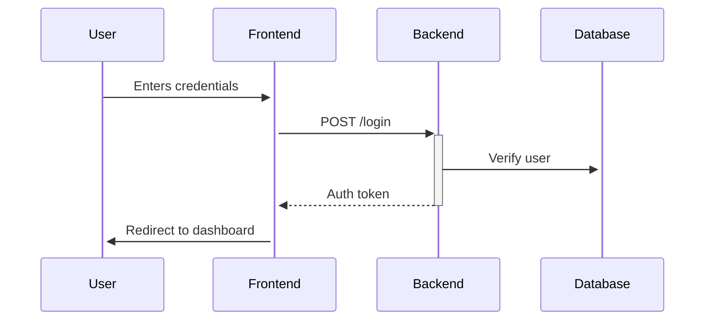
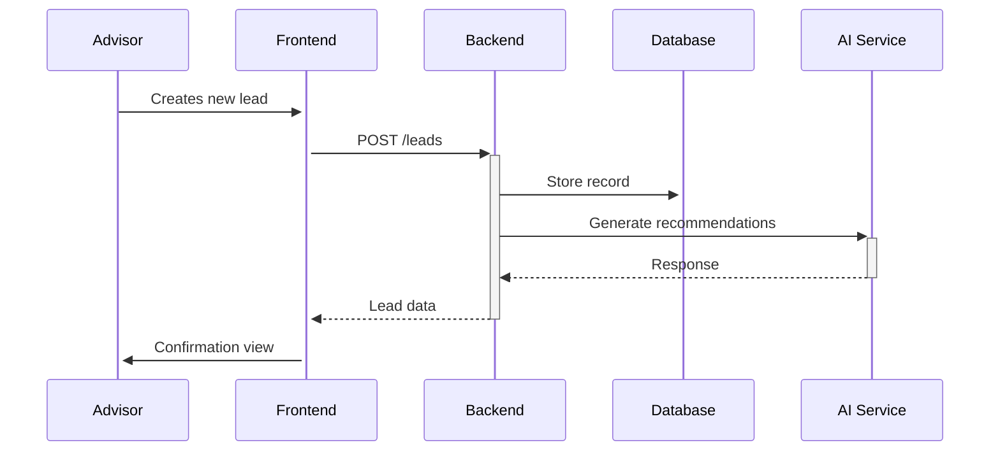
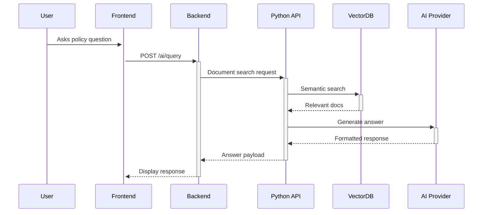

# CRM MVP with AI Integration

## Overview

This is a professional, scalable CRM (Customer Relationship Management) MVP with AI integration. The system features:

- User authentication with admin and advisor roles
- Lead management system
- AI-powered policy assistant with RAG (Retrieval-Augmented Generation)
- Integration with OpenAI and DeepSeek AI services
- Responsive UI built with Vue.js, Inertia.js, and Tailwind CSS
- Robust backend architecture following Laravel best practices

## Features

### Core CRM Features
- **User Management**: Admin and advisor roles with different permissions
- **Lead Management**: Create, view, update, and delete leads
- **Assignment System**: Assign leads to advisors
- **Activity Tracking**: Add notes to leads

### AI Features
- **Policy Assistant**: Query company policy documents using natural language
- **Multi-AI Support**: Switch between OpenAI and DeepSeek
- **RAG Implementation**: Retrieval-Augmented Generation for accurate policy answers
- **Fallback System**: Uses general AI when policy documents don't contain answers

### Technical Features
- **Repository Pattern**: Clean separation of concerns
- **Service Classes**: Dedicated services for AI integration
- **Job Queues**: Background processing for notifications
- **Unit Tests**: Comprehensive test coverage

## System Architecture

```
CRM System
├── Laravel Backend (PHP)
│   ├── API Endpoints
│   ├── Services/Repositories
│   ├── Database (MySQL)
│   └── Queue System
├── Vue.js/Inertia Frontend
│   ├── Admin Interface
│   └── Advisor Interface
├── AI Services
│   ├── OpenAI Service
│   ├── DeepSeek Service
│   └── Python API (FastAPI)
└── Policy Document Storage
    └── Vector Database (FAISS/Chroma)
```

## Installation

### Prerequisites

- PHP 8.1+
- Composer
- Node.js 16+
- npm
- MySQL 5.7+
- Python 3.8+ (for AI service)

### Backend Setup

1. Clone the repository:
   ```bash
   git clone https://github.com/your-repo/crm-mvp.git
   cd crm-mvp
   ```

2. Install PHP dependencies:
   ```bash
   composer install
   ```

3. Create and configure `.env` file:
   ```bash
   cp .env.example .env
   ```

4. Generate application key:
   ```bash
   php artisan key:generate
   ```

5. Run migrations and seed the database:
   ```bash
   php artisan migrate --seed
   ```

### Frontend Setup

1. Install JavaScript dependencies:
   ```bash
   npm install
   ```

2. Build assets:
   ```bash
   npm run build
   ```

### AI Service Setup

1. Navigate to the AI service directory:
   ```bash
   cd ai_service
   ```

2. Install Python dependencies:
   ```bash
   pip install -r requirements.txt
   ```

3. Create `.env` file:
   ```bash
   cp .env.example .env
   ```

## Running the Application

1. Start the Laravel development server:
   ```bash
   php artisan serve
   ```

2. Start the queue worker (in a new terminal):
   ```bash
   php artisan queue:work
   ```

3. Start the Python API (in a new terminal):
   ```bash
   cd ai_service
   python main.py
   ```

4. Access the application at: `http://localhost:8000`

## Testing

Run the test suite with:
```bash
php artisan test
```

## Configuration

### Environment Variables

Key backend environment variables:

```ini
# AI Services
OPENAI_API_KEY=your-openai-key
DEEPSEEK_API_KEY=your-deepseek-key
PYTHON_API_URL=http://localhost:8000

# Database
DB_CONNECTION=mysql
DB_HOST=127.0.0.1
DB_PORT=3306
DB_DATABASE=crm_mvp
DB_USERNAME=root
DB_PASSWORD=
```

### Default Credentials

After seeding:
- **Admin User**: 
  - Email: `admin@crm.test`
  - Password: `password`
- **Advisor Users**:
  - Email: `advisor1@crm.test` to `advisor5@crm.test`
  - Password: `password`

## Usage

### Admin Features
- View all leads and advisors
- Create/update/delete advisors
- Assign leads to advisors
- Access all system features

### Advisor Features
- View only assigned leads
- Add notes to leads
- Use policy assistant

### Policy Assistant
1. Navigate to "Policy Assistant" in the sidebar
2. Select AI service (OpenAI or DeepSeek)
3. Enter your question about company policies
4. View the generated answer with source information

## Deployment

For production deployment:

1. Configure proper database credentials
2. Set `APP_ENV=production`
3. Set `APP_DEBUG=false`
4. Configure queue worker as a daemon process
5. Set up proper SSL certificates
6. Configure production-ready Python API server (e.g., with Gunicorn)

## Contributing

1. Fork the repository
2. Create your feature branch (`git checkout -b feature/your-feature`)
3. Commit your changes (`git commit -am 'Add some feature'`)
4. Push to the branch (`git push origin feature/your-feature`)
5. Create a new Pull Request

## License

This project is licensed under the MIT License - see the [LICENSE](LICENSE) file for details.

## Support

For support or questions, please contact the project maintainers.

# CRM MVP Architecture with AI Integration

## System Overview
┌───────────────────────────────────────────────────────────────────────────────┐
│                            CRM MVP Architecture                              │
├───────────────────────────┬───────────────────────────────────────────────────┤
│       Frontend            │                Backend                            │
│  (Vue.js + Inertia.js)    │            (Laravel + PHP)                       │
│                           │                                                   │
│  ┌─────────────────────┐  │  ┌─────────────────────────────────────────────┐  │
│  │     Components      │  │  │               Controllers                   │  │
│  │ - AppLayout.vue     │  │  │ - AuthController                            │  │
│  │ - AppSidebar.vue    │  │  │ - LeadController                            │  │
│  │ - AppHeader.vue     │  │  │ - AdvisorController                         │  │
│  │ - LeadStatusBadge.vue│  │  │ - AIController                             │  │
│  └─────────┬───────────┘  │  └───────────────┬─────────────────────────────┘  │
│            │               │                  │                                │
│  ┌─────────▼───────────┐  │  ┌───────────────▼─────────────────────────────┐  │
│  │       Pages         │  │  │               Services                      │  │
│  │ - Auth/Login.vue    │  │  │ - PolicyDocumentService                     │  │
│  │ - Dashboard.vue     │  │  │ - OpenAIService                             │  │
│  │ - Leads/Index.vue   │  │  │ - DeepSeekService                           │  │
│  │ - Leads/Show.vue    │  │  │ - AIServiceFactory                          │  │
│  │ - AI/PolicyAssistant.vue│ └───────────────┬─────────────────────────────┘  │
│  └─────────────────────┘  │                  │                                │
│                           │  ┌───────────────▼─────────────────────────────┐  │
│  Tailwind CSS             │  │               Repositories                  │  │
│  (Styling System)         │  │ - LeadRepository                            │  │
│                           │  │ - UserRepository                            │  │
│                           │  └───────────────┬─────────────────────────────┘  │
│                           │                  │                                │
│                           │  ┌───────────────▼─────────────────────────────┐  │
│                           │  │               Models                        │  │
│                           │  │ - User                                      │  │
│                           │  │ - Lead                                      │  │
│                           │  │ - PolicyDocument                            │  │
│                           │  │ - LeadNote                                  │  │
│                           │  └───────────────┬─────────────────────────────┘  │
│                           │                  │                                │
│                           │  ┌───────────────▼─────────────────────────────┐  │
│                           │  │               Database                      │  │
│                           │  │ - MySQL                                     │  │
│                           │  └─────────────────────────────────────────────┘  │
├───────────────────────────┼───────────────────────────────────────────────────┤
│        AI Services        │             Python API                            │
│                           │  (FastAPI + Sentence Transformers)               │
│  ┌─────────────────────┐  │  ┌─────────────────────────────────────────────┐  │
│  │   OpenAI Service    │  │  │ - Document Embeddings                        │  │
│  └─────────┬───────────┘  │  │ - Semantic Search                           │  │
│            │               │  │ - RAG Implementation                        │  │
│  ┌─────────▼───────────┐  │  └─────────────────────────────────────────────┘  │
│  │   DeepSeek Service  │  │                                                   │
│  └─────────────────────┘  │                                                   │
└───────────────────────────┴───────────────────────────────────────────────────┘
```

## Architecture Components

### 1. Frontend Layer
- **Framework**: Vue.js 3 with Inertia.js
- **UI Components**:
  - `AppLayout.vue` - Main application layout
  - `AppSidebar.vue` - Navigation sidebar
  - `LeadStatusBadge.vue` - Status indicators
- **Pages**:
  - Authentication flows
  - Dashboard view
  - Lead management
  - AI policy assistant
- **Styling**: Tailwind CSS utility framework

### 2. Backend Layer
- **Framework**: Laravel 12 (PHP)
- **Controllers**:
  - AuthController - Authentication flows
  - LeadController - CRM record management
  - AIController - AI integration endpoints
- **Services**:
  - PolicyDocumentService - Document processing
  - AIServiceFactory - Provider abstraction
- **Data Access**:
  - LeadRepository - Business logic encapsulation
  - UserRepository - User data operations

### 3. AI Integration
- **Providers**:
  - OpenAI - GPT models
  - DeepSeek - Alternative LLM
- **Python API**:
  - FastAPI server
  - Sentence Transformers for embeddings
  - RAG (Retrieval-Augmented Generation) pipeline

### 4. Data Layer
- **Database**: MySQL
- **Models**:
  - User - Authentication and roles
  - Lead - Customer records
  - PolicyDocument - AI-processed documents
  - LeadNote - Activity tracking

## System Flows

### Authentication Flow


### Lead Processing Flow


### AI Document Flow


## Development Setup

### Prerequisites
- PHP 8.2+
- Node.js 18+
- MySQL 8+
- Python 3.10+ (for AI services)

### Installation
```bash
# Clone repository
git clone https://github.com/your-repo/crm-ai.git
cd crm-ai

# Backend setup
composer install
cp .env.example .env
php artisan key:generate

# Frontend setup
npm install
npm run build

# Database setup
php artisan migrate --seed

# AI service setup (separate repo)
cd ai-services
pip install -r requirements.txt
```

## Configuration
Update these environment variables:

```ini
# .env
DB_CONNECTION=mysql
DB_HOST=127.0.0.1
DB_PORT=3306
DB_DATABASE=crm_ai
DB_USERNAME=root
DB_PASSWORD=

OPENAI_API_KEY=your_key
DEEPSEEK_API_KEY=your_key

AI_SERVICE_URL=http://localhost:8001
```

## Deployment
```bash
# Production build
npm run build
php artisan optimize

# Run server
php artisan serve
```

## License
MIT Licensed. See `LICENSE` file.